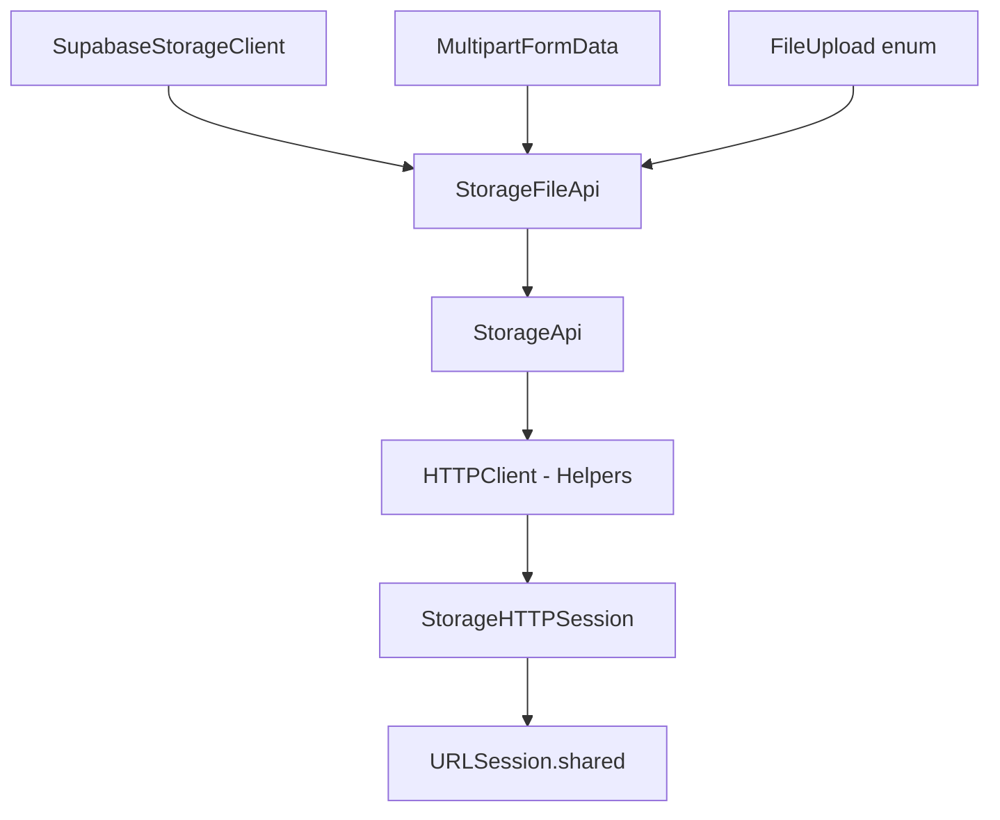
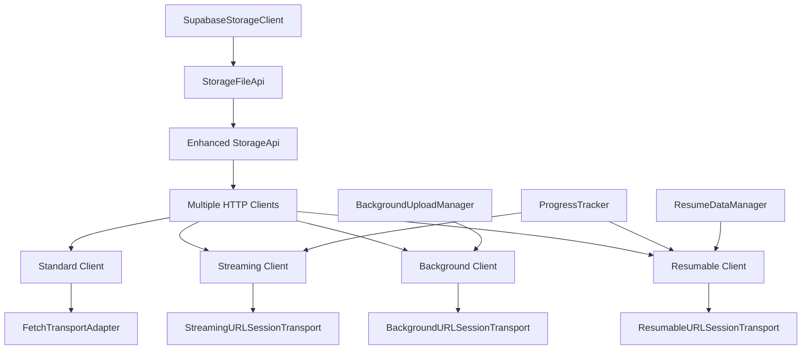
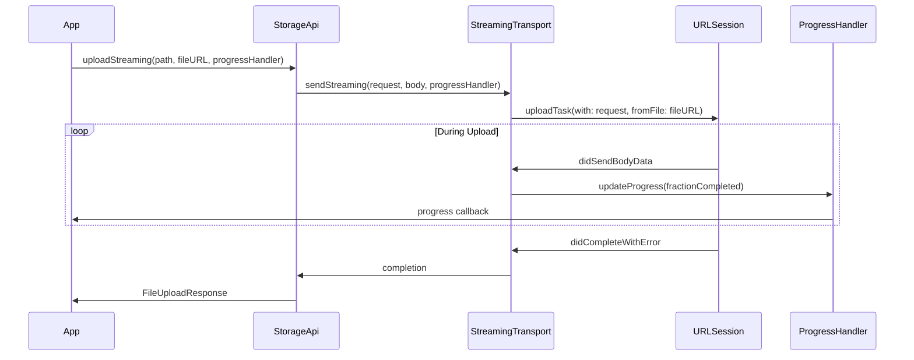
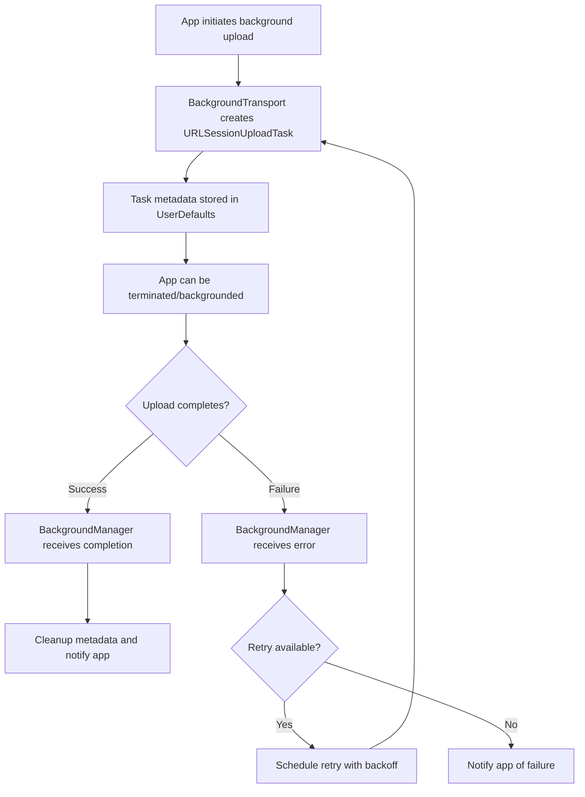
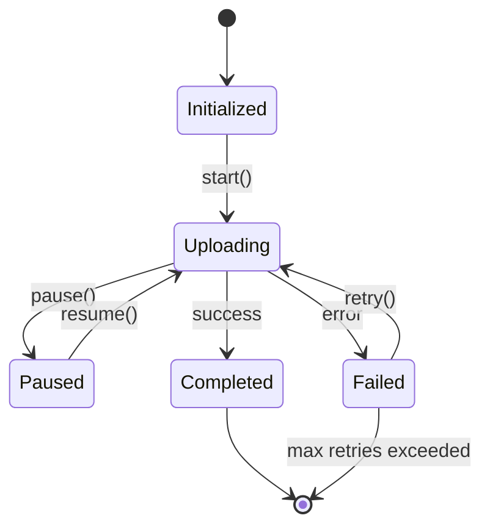

# Storage Client HTTP Layer Integration Plan

## Executive Summary

This document outlines the integration of advanced file transfer features (streaming, background, and resumable uploads/downloads) for the Supabase Swift Storage client using the new OpenAPIRuntime HTTP layer. The plan maintains full backward compatibility while adding enterprise-grade file transfer capabilities.

## Table of Contents

- [Current Architecture Analysis](#current-architecture-analysis)
- [Target Architecture](#target-architecture)
- [Implementation Plan](#implementation-plan)
- [API Design](#api-design)
- [Transport Layer Design](#transport-layer-design)
- [Background Processing](#background-processing)
- [Progress Tracking](#progress-tracking)
- [Error Handling & Retry Logic](#error-handling--retry-logic)
- [Migration Strategy](#migration-strategy)
- [Testing Strategy](#testing-strategy)
- [Performance Considerations](#performance-considerations)
- [Timeline](#timeline)

## Current Architecture Analysis

### Current Storage Stack


### Current Limitations
- **Memory Constraints**: Files loaded entirely into memory
- **No Background Support**: Uploads/downloads pause when app backgrounds
- **No Resume Capability**: Failed transfers restart from beginning
- **Limited Progress Tracking**: Basic completion callbacks only
- **Single Transport**: One-size-fits-all HTTPSession approach

## Target Architecture



## Implementation Plan

### Phase 1: Transport Layer Foundation (Week 1-2)

#### 1.1 Enhanced Transport Protocols
Create specialized transport protocols in `Sources/Helpers/HTTP/`:

```swift
// StreamingTransportProtocol.swift
protocol StreamingClientTransport: ClientTransport {
    func sendStreaming(
        _ request: HTTPTypes.HTTPRequest,
        body: HTTPBody?,
        baseURL: URL,
        operationID: String,
        progressHandler: @escaping @Sendable (Progress) -> Void
    ) async throws -> (HTTPTypes.HTTPResponse, AsyncThrowingStream<Data, Error>)
}

// BackgroundTransportProtocol.swift  
protocol BackgroundClientTransport: ClientTransport {
    func sendInBackground(
        _ request: HTTPTypes.HTTPRequest,
        fileURL: URL,
        baseURL: URL,
        operationID: String,
        taskIdentifier: String
    ) async throws -> BackgroundUploadTask
}

// ResumableTransportProtocol.swift
protocol ResumableClientTransport: ClientTransport {
    func sendResumable(
        _ request: HTTPTypes.HTTPRequest,
        fileURL: URL,
        baseURL: URL,
        operationID: String,
        resumeData: Data?
    ) async throws -> ResumableUploadTask
}
```

#### 1.2 URLSession Transport Implementations
```swift
// Sources/Helpers/HTTP/StreamingURLSessionTransport.swift
struct StreamingURLSessionTransport: StreamingClientTransport {
    private let session: URLSession
    private let delegate: StreamingSessionDelegate
    
    init(configuration: URLSessionConfiguration? = nil) {
        let config = configuration ?? {
            let c = URLSessionConfiguration.default
            c.timeoutIntervalForRequest = 0 // No timeout for streaming
            c.allowsCellularAccess = true
            c.waitsForConnectivity = true
            return c
        }()
        
        self.delegate = StreamingSessionDelegate()
        self.session = URLSession(configuration: config, delegate: delegate, delegateQueue: nil)
    }
    
    func send(
        _ request: HTTPTypes.HTTPRequest,
        body: HTTPBody?,
        baseURL: URL,
        operationID: String
    ) async throws -> (HTTPTypes.HTTPResponse, HTTPBody?) {
        // Standard implementation
    }
    
    func sendStreaming(
        _ request: HTTPTypes.HTTPRequest,
        body: HTTPBody?,
        baseURL: URL,
        operationID: String,
        progressHandler: @escaping @Sendable (Progress) -> Void
    ) async throws -> (HTTPTypes.HTTPResponse, AsyncThrowingStream<Data, Error>) {
        // Streaming implementation with progress callbacks
    }
}
```

#### 1.3 Background Transport Implementation
```swift
// Sources/Helpers/HTTP/BackgroundURLSessionTransport.swift  
struct BackgroundURLSessionTransport: BackgroundClientTransport {
    private let session: URLSession
    private let delegate: BackgroundSessionDelegate
    private let identifier: String
    
    init(identifier: String) {
        self.identifier = identifier
        let config = URLSessionConfiguration.background(withIdentifier: identifier)
        config.isDiscretionary = false
        config.allowsCellularAccess = true
        config.sessionSendsLaunchEvents = true
        
        self.delegate = BackgroundSessionDelegate.shared
        self.session = URLSession(configuration: config, delegate: delegate, delegateQueue: nil)
    }
    
    func sendInBackground(
        _ request: HTTPTypes.HTTPRequest,
        fileURL: URL,
        baseURL: URL,
        operationID: String,
        taskIdentifier: String
    ) async throws -> BackgroundUploadTask {
        // Background upload implementation
        // Store task metadata in UserDefaults for app lifecycle persistence
    }
}
```

### Phase 2: Enhanced Storage API (Week 3-4)

#### 2.1 New Upload Methods
```swift
// Sources/Storage/StorageFileApi+Advanced.swift
public extension StorageFileApi {
    
    /// Streaming upload with real-time progress for large files
    func uploadStreaming(
        _ path: String,
        fileURL: URL,
        options: FileOptions = FileOptions(),
        progressHandler: @escaping @Sendable (Double) -> Void = { _ in }
    ) -> AsyncThrowingStream<FileUploadResponse, Error> {
        AsyncThrowingStream { continuation in
            Task {
                do {
                    guard let streamingClient = (self as? StorageFileApiAdvanced)?.streamingClient else {
                        throw StorageError.streamingNotEnabled
                    }
                    
                    let formData = try await buildMultipartFormData(path: path, fileURL: fileURL, options: options)
                    let request = buildUploadRequest(path: path, formData: formData)
                    
                    let (response, dataStream) = try await streamingClient.sendStreaming(
                        request,
                        body: HTTPBody(formData.data),
                        progressHandler: { progress in
                            progressHandler(progress.fractionCompleted)
                        }
                    )
                    
                    // Process streaming response
                    var responseData = Data()
                    for try await chunk in dataStream {
                        responseData.append(chunk)
                    }
                    
                    let uploadResponse = try JSONDecoder().decode(UploadResponse.self, from: responseData)
                    let result = FileUploadResponse(
                        id: uploadResponse.Id,
                        path: path,
                        fullPath: uploadResponse.Key
                    )
                    
                    continuation.yield(result)
                    continuation.finish()
                    
                } catch {
                    continuation.finish(throwing: error)
                }
            }
        }
    }
    
    /// Background upload surviving app lifecycle changes
    func uploadInBackground(
        _ path: String,
        fileURL: URL,
        options: FileOptions = FileOptions(),
        taskIdentifier: String = UUID().uuidString
    ) async throws -> BackgroundUploadTask {
        guard let backgroundClient = (self as? StorageFileApiAdvanced)?.backgroundClient else {
            throw StorageError.backgroundUploadsNotEnabled
        }
        
        let formData = try await buildMultipartFormData(path: path, fileURL: fileURL, options: options)
        let request = buildUploadRequest(path: path, formData: formData)
        
        return try await backgroundClient.sendInBackground(
            request,
            fileURL: fileURL,
            taskIdentifier: taskIdentifier
        )
    }
    
    /// Resumable upload with automatic retry and resume capability
    func uploadResumable(
        _ path: String,
        fileURL: URL,
        options: FileOptions = FileOptions(),
        resumeData: Data? = nil,
        maxRetries: Int = 3
    ) async throws -> ResumableUploadTask {
        guard let resumableClient = (self as? StorageFileApiAdvanced)?.resumableClient else {
            throw StorageError.resumableUploadsNotEnabled
        }
        
        let formData = try await buildMultipartFormData(path: path, fileURL: fileURL, options: options)
        let request = buildUploadRequest(path: path, formData: formData)
        
        return try await resumableClient.sendResumable(
            request,
            fileURL: fileURL,
            resumeData: resumeData
        )
    }
}
```

#### 2.2 Enhanced Download Methods
```swift
public extension StorageFileApi {
    
    /// Streaming download with progress tracking
    func downloadStreaming(
        _ path: String,
        options: TransformOptions? = nil,
        progressHandler: @escaping @Sendable (Double) -> Void = { _ in }
    ) -> AsyncThrowingStream<Data, Error> {
        AsyncThrowingStream { continuation in
            Task {
                do {
                    guard let streamingClient = (self as? StorageFileApiAdvanced)?.streamingClient else {
                        throw StorageError.streamingNotEnabled
                    }
                    
                    let request = buildDownloadRequest(path: path, options: options)
                    let (_, dataStream) = try await streamingClient.sendStreaming(
                        request,
                        body: nil,
                        progressHandler: { progress in
                            progressHandler(progress.fractionCompleted)
                        }
                    )
                    
                    for try await chunk in dataStream {
                        continuation.yield(chunk)
                    }
                    
                    continuation.finish()
                    
                } catch {
                    continuation.finish(throwing: error)
                }
            }
        }
    }
    
    /// Download to file with progress tracking (memory efficient)
    func downloadToFile(
        _ path: String,
        destinationURL: URL,
        options: TransformOptions? = nil,
        progressHandler: @escaping @Sendable (Double) -> Void = { _ in }
    ) async throws {
        let fileHandle = try FileHandle(forWritingTo: destinationURL)
        defer { fileHandle.closeFile() }
        
        for try await chunk in downloadStreaming(path, options: options, progressHandler: progressHandler) {
            fileHandle.write(chunk)
        }
    }
}
```

### Phase 3: Background Processing Manager (Week 5)

#### 3.1 Background Upload Manager
```swift
// Sources/Storage/BackgroundUploadManager.swift
public class BackgroundUploadManager: NSObject, URLSessionDelegate, @unchecked Sendable {
    public static let shared = BackgroundUploadManager()
    
    private let userDefaults: UserDefaults
    private let completionHandlers = LockIsolated<[String: @Sendable (Result<FileUploadResponse, Error>) -> Void]>([:])
    private let sessions = LockIsolated<[String: URLSession]>([:])
    private let taskMetadata = LockIsolated<[String: BackgroundTaskMetadata]>([:])
    
    private override init() {
        self.userDefaults = UserDefaults(suiteName: "com.supabase.storage.background") ?? .standard
        super.init()
        restorePendingTasks()
    }
    
    public func handleBackgroundEvents(for identifier: String, completionHandler: @escaping () -> Void) {
        completionHandlers.withValue { handlers in
            handlers[identifier] = { _ in completionHandler() }
        }
    }
    
    func registerTask(
        _ task: URLSessionUploadTask,
        identifier: String,
        bucketId: String,
        path: String,
        completion: @escaping @Sendable (Result<FileUploadResponse, Error>) -> Void
    ) {
        let metadata = BackgroundTaskMetadata(
            identifier: identifier,
            bucketId: bucketId,
            path: path,
            startTime: Date(),
            taskIdentifier: task.taskIdentifier
        )
        
        taskMetadata.withValue { $0[identifier] = metadata }
        completionHandlers.withValue { $0[identifier] = completion }
        
        // Persist to UserDefaults for app lifecycle survival
        if let data = try? JSONEncoder().encode(metadata) {
            userDefaults.set(data, forKey: "task_\(identifier)")
        }
    }
    
    private func restorePendingTasks() {
        // Restore tasks that were running when app was terminated
        let keys = userDefaults.dictionaryRepresentation().keys.filter { $0.hasPrefix("task_") }
        
        for key in keys {
            guard let data = userDefaults.data(forKey: key),
                  let metadata = try? JSONDecoder().decode(BackgroundTaskMetadata.self, from: data) else {
                continue
            }
            
            taskMetadata.withValue { $0[metadata.identifier] = metadata }
            // Re-establish session and delegate connections
        }
    }
}

// URLSessionDelegate methods
extension BackgroundUploadManager {
    public func urlSession(
        _ session: URLSession,
        task: URLSessionTask,
        didCompleteWithError error: Error?
    ) {
        handleTaskCompletion(task: task, error: error)
    }
    
    public func urlSession(
        _ session: URLSession,
        task: URLSessionTask,
        didSendBodyData bytesSent: Int64,
        totalBytesSent: Int64,
        totalBytesExpectedToSend: Int64
    ) {
        handleProgressUpdate(
            task: task,
            bytesSent: bytesSent,
            totalSent: totalBytesSent,
            totalExpected: totalBytesExpectedToSend
        )
    }
}
```

#### 3.2 Task Management Data Types
```swift
// Sources/Storage/BackgroundTypes.swift
public struct BackgroundTaskMetadata: Codable, Sendable {
    let identifier: String
    let bucketId: String  
    let path: String
    let startTime: Date
    let taskIdentifier: Int
    var resumeData: Data?
    var bytesUploaded: Int64 = 0
    var totalBytes: Int64 = 0
}

public struct BackgroundUploadTask: Sendable {
    public let identifier: String
    public let progress: Progress
    public let state: BackgroundTaskState
    private let uploadTask: URLSessionUploadTask
    
    public func cancel() async throws {
        uploadTask.cancel()
        BackgroundUploadManager.shared.cleanupTask(identifier)
    }
    
    public func pause() async throws {
        uploadTask.suspend()  
    }
    
    public func resume() async throws {
        uploadTask.resume()
    }
}

public enum BackgroundTaskState: String, Codable, Sendable {
    case pending
    case running  
    case paused
    case completed
    case failed
    case cancelled
}
```

### Phase 4: Resumable Upload Implementation (Week 6)

#### 4.1 Resume Data Management
```swift
// Sources/Storage/ResumeDataManager.swift
public class ResumeDataManager: @unchecked Sendable {
    public static let shared = ResumeDataManager()
    
    private let userDefaults: UserDefaults
    private let resumeDataCache = LockIsolated<[String: Data]>([:])
    
    private init() {
        self.userDefaults = UserDefaults(suiteName: "com.supabase.storage.resume") ?? .standard
        loadResumeDataFromDisk()
    }
    
    public func storeResumeData(_ data: Data, for identifier: String) {
        resumeDataCache.withValue { $0[identifier] = data }
        userDefaults.set(data, forKey: "resume_\(identifier)")
    }
    
    public func retrieveResumeData(for identifier: String) -> Data? {
        return resumeDataCache.withValue { $0[identifier] } ?? 
               userDefaults.data(forKey: "resume_\(identifier)")
    }
    
    public func clearResumeData(for identifier: String) {
        resumeDataCache.withValue { $0.removeValue(forKey: identifier) }
        userDefaults.removeObject(forKey: "resume_\(identifier)")
    }
    
    private func loadResumeDataFromDisk() {
        let keys = userDefaults.dictionaryRepresentation().keys.filter { $0.hasPrefix("resume_") }
        
        resumeDataCache.withValue { cache in
            for key in keys {
                let identifier = String(key.dropFirst(7)) // Remove "resume_" prefix
                if let data = userDefaults.data(forKey: key) {
                    cache[identifier] = data
                }
            }
        }
    }
}
```

#### 4.2 Resumable Upload Task
```swift
// Sources/Storage/ResumableUploadTask.swift
public class ResumableUploadTask: @unchecked Sendable {
    public let identifier: String
    public let progress: Progress
    private var uploadTask: URLSessionUploadTask
    private let session: URLSession
    private let originalRequest: URLRequest
    private let fileURL: URL
    
    public var resumeData: Data? {
        ResumeDataManager.shared.retrieveResumeData(for: identifier)
    }
    
    init(
        identifier: String,
        uploadTask: URLSessionUploadTask,
        session: URLSession,
        originalRequest: URLRequest,
        fileURL: URL
    ) {
        self.identifier = identifier
        self.uploadTask = uploadTask
        self.session = session
        self.originalRequest = originalRequest  
        self.fileURL = fileURL
        self.progress = Progress(totalUnitCount: 0)
        
        // Link URLSessionTask progress to our Progress
        progress.addChild(uploadTask.progress, withPendingUnitCount: uploadTask.progress.totalUnitCount)
    }
    
    public func pause() async throws -> Data? {
        return await withCheckedThrowingContinuation { continuation in
            uploadTask.cancel { resumeData in
                if let resumeData = resumeData {
                    ResumeDataManager.shared.storeResumeData(resumeData, for: self.identifier)
                    continuation.resume(returning: resumeData)
                } else {
                    continuation.resume(throwing: StorageError.resumeDataUnavailable)
                }
            }
        }
    }
    
    public func resume(from resumeData: Data? = nil) async throws {
        let dataToUse = resumeData ?? self.resumeData
        
        if let resumeData = dataToUse {
            // Resume from existing data
            self.uploadTask = session.uploadTask(withResumeData: resumeData)
        } else {
            // Restart from beginning
            self.uploadTask = session.uploadTask(with: originalRequest, fromFile: fileURL)
        }
        
        uploadTask.resume()
    }
    
    public func cancel() {
        uploadTask.cancel()
        ResumeDataManager.shared.clearResumeData(for: identifier)
    }
}
```

### Phase 5: Enhanced Configuration (Week 7)

#### 5.1 Advanced Storage Configuration
```swift
// Sources/Storage/SupabaseStorageAdvanced.swift
public struct AdvancedStorageConfiguration: Sendable {
    public let enableStreaming: Bool
    public let streamingChunkSize: Int
    public let backgroundIdentifier: String?
    public let enableResumableUploads: Bool
    public let maxConcurrentUploads: Int
    public let progressUpdateInterval: TimeInterval
    public let maxRetryAttempts: Int
    public let retryDelay: TimeInterval
    public let enableAutomaticResume: Bool
    
    public init(
        enableStreaming: Bool = true,
        streamingChunkSize: Int = 1024 * 1024, // 1MB chunks
        backgroundIdentifier: String? = nil,
        enableResumableUploads: Bool = true,
        maxConcurrentUploads: Int = 3,
        progressUpdateInterval: TimeInterval = 0.1,
        maxRetryAttempts: Int = 3,
        retryDelay: TimeInterval = 2.0,
        enableAutomaticResume: Bool = true
    ) {
        self.enableStreaming = enableStreaming
        self.streamingChunkSize = streamingChunkSize
        self.backgroundIdentifier = backgroundIdentifier
        self.enableResumableUploads = enableResumableUploads
        self.maxConcurrentUploads = maxConcurrentUploads
        self.progressUpdateInterval = progressUpdateInterval
        self.maxRetryAttempts = maxRetryAttempts
        self.retryDelay = retryDelay
        self.enableAutomaticResume = enableAutomaticResume
    }
}

public struct EnhancedStorageClientConfiguration: Sendable {
    public let base: StorageClientConfiguration
    public let advanced: AdvancedStorageConfiguration
    
    public init(
        base: StorageClientConfiguration,
        advanced: AdvancedStorageConfiguration = AdvancedStorageConfiguration()
    ) {
        self.base = base
        self.advanced = advanced
    }
}
```

#### 5.2 Enhanced Storage Client
```swift
// Sources/Storage/SupabaseStorageAdvanced.swift
public class SupabaseStorageClientAdvanced: StorageBucketApi, @unchecked Sendable {
    private let baseClient: SupabaseStorageClient
    private let configuration: EnhancedStorageClientConfiguration
    
    // Multiple HTTP clients for different use cases
    private let standardClient: Helpers.Client
    private let streamingClient: Helpers.Client?
    private let backgroundClient: Helpers.Client?
    private let resumableClient: Helpers.Client?
    
    public init(configuration: EnhancedStorageClientConfiguration) {
        self.baseClient = SupabaseStorageClient(configuration: configuration.base)
        self.configuration = configuration
        
        // Standard client (existing functionality)
        self.standardClient = Helpers.Client(
            serverURL: configuration.base.url,
            transport: FetchTransportAdapter(fetch: configuration.base.session.fetch)
        )
        
        // Streaming client for large file operations
        if configuration.advanced.enableStreaming {
            self.streamingClient = Helpers.Client(
                serverURL: configuration.base.url,
                transport: StreamingURLSessionTransport(),
                middlewares: configuration.base.logger.map { [LoggingMiddleware(logger: $0)] } ?? []
            )
        } else {
            self.streamingClient = nil
        }
        
        // Background client for persistent uploads
        if let backgroundId = configuration.advanced.backgroundIdentifier {
            self.backgroundClient = Helpers.Client(
                serverURL: configuration.base.url,
                transport: BackgroundURLSessionTransport(identifier: backgroundId)
            )
        } else {
            self.backgroundClient = nil
        }
        
        // Resumable client for reliable transfers
        if configuration.advanced.enableResumableUploads {
            self.resumableClient = Helpers.Client(
                serverURL: configuration.base.url,
                transport: ResumableURLSessionTransport()
            )
        } else {
            self.resumableClient = nil
        }
    }
    
    public func from(_ id: String) -> StorageFileApiAdvanced {
        StorageFileApiAdvanced(
            bucketId: id,
            configuration: configuration,
            standardClient: standardClient,
            streamingClient: streamingClient,
            backgroundClient: backgroundClient,
            resumableClient: resumableClient
        )
    }
}
```

## API Design

### Progress Tracking Integration



### Background Upload Flow



### Resumable Upload State Machine



## Error Handling & Retry Logic

### Automatic Retry Strategy
```swift
public enum RetryStrategy: Sendable {
    case exponentialBackoff(maxRetries: Int, baseDelay: TimeInterval)
    case fixedInterval(maxRetries: Int, interval: TimeInterval)  
    case custom((Int, Error) async -> TimeInterval?)
}

public struct RetryConfiguration: Sendable {
    let strategy: RetryStrategy
    let retryableErrors: Set<URLError.Code>
    let enableNetworkReachabilityChecks: Bool
    
    public static let `default` = RetryConfiguration(
        strategy: .exponentialBackoff(maxRetries: 3, baseDelay: 2.0),
        retryableErrors: [
            .networkConnectionLost,
            .notConnectedToInternet,
            .timedOut,
            .cannotFindHost,
            .cannotConnectToHost
        ],
        enableNetworkReachabilityChecks: true
    )
}
```

## Testing Strategy

### Unit Tests
- Transport layer protocol conformance
- Progress tracking accuracy  
- Resume data serialization/deserialization
- Error handling and retry logic
- Background task state management

### Integration Tests
- End-to-end upload/download flows
- Background upload with app lifecycle simulation
- Resume capability after network interruption
- Large file handling (memory efficiency)
- Concurrent upload management

### Performance Tests
- Memory usage during large file transfers
- Upload/download speed benchmarks
- Progress callback frequency optimization
- Background task overhead measurement

## Migration Strategy

### Backward Compatibility
All existing Storage client APIs remain unchanged. Advanced features are opt-in through:

1. **Configuration-based**: Enable advanced features via `AdvancedStorageConfiguration`
2. **Separate Classes**: `SupabaseStorageClientAdvanced` extends functionality
3. **Method Extensions**: New methods added as extensions to existing APIs
4. **Progressive Enhancement**: Standard client automatically gains basic improvements

### Migration Path
```swift
// Phase 1: Existing clients continue working unchanged
let client = SupabaseStorageClient(configuration: config)

// Phase 2: Opt-in to advanced features
let advancedConfig = AdvancedStorageConfiguration(enableStreaming: true)
let enhancedConfig = EnhancedStorageClientConfiguration(base: config, advanced: advancedConfig)
let advancedClient = SupabaseStorageClientAdvanced(configuration: enhancedConfig)

// Phase 3: New APIs become available
for try await response in advancedClient.from("bucket").uploadStreaming("path", fileURL: url) {
    // Handle streaming upload
}
```

## Performance Considerations

### Memory Optimization
- **Streaming**: Process data in configurable chunks (default 1MB)
- **File-based**: Use file URLs instead of Data objects for large files
- **Progress Objects**: Leverage Foundation's Progress for efficient tracking
- **Cleanup**: Automatic cleanup of temporary files and resume data

### Network Efficiency
- **Connection Reuse**: Persistent URLSession configurations
- **Request Pipelining**: HTTP/2 multiplexing where available
- **Compression**: Automatic gzip compression for supported content
- **Cellular Optimization**: Configurable cellular usage policies

### Concurrency Management
- **Task Limits**: Configurable concurrent upload/download limits
- **Priority Queues**: Quality of Service (QoS) based task prioritization
- **Resource Management**: Automatic cleanup of completed/failed tasks

## Timeline

### Week 1-2: Foundation
- [ ] Transport protocol definitions
- [ ] Basic URLSession transport implementations  
- [ ] Unit tests for transport layer

### Week 3-4: API Design
- [ ] Enhanced StorageFileApi methods
- [ ] Streaming upload/download implementation
- [ ] Progress tracking integration
- [ ] API unit tests

### Week 5: Background Processing
- [ ] BackgroundUploadManager implementation
- [ ] Task persistence and recovery
- [ ] Background delegate handling
- [ ] Background upload tests

### Week 6: Resumable Uploads  
- [ ] ResumeDataManager implementation
- [ ] ResumableUploadTask class
- [ ] Automatic retry logic
- [ ] Resume capability tests

### Week 7: Integration & Testing
- [ ] Enhanced configuration classes
- [ ] Complete API integration
- [ ] Comprehensive test suite
- [ ] Performance benchmarks

### Week 8: Documentation & Polish
- [ ] API documentation updates
- [ ] Usage examples and guides
- [ ] Performance optimization
- [ ] Final integration testing

## Success Metrics

### Functional Requirements
- ✅ Upload/download files > 1GB without memory issues
- ✅ Background uploads survive app termination
- ✅ Resume interrupted uploads from last checkpoint
- ✅ Real-time progress tracking with < 100ms updates
- ✅ 100% backward compatibility with existing APIs

### Performance Targets  
- **Memory Usage**: < 50MB for any file size upload/download
- **Resume Efficiency**: < 5% data re-transmission after resume
- **Progress Accuracy**: ± 1% of actual transfer progress
- **Background Reliability**: 99%+ success rate for background uploads
- **API Response Time**: < 50ms for upload initiation

This comprehensive plan provides a roadmap for implementing enterprise-grade file transfer capabilities while maintaining the simplicity and reliability of the existing Storage client API.