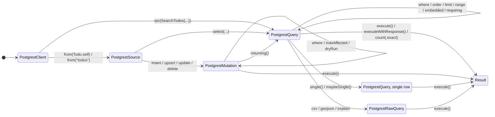

# PostgREST v3 — design

Date: 2026-08-10. Revised: 2026-08-11 after a design review, and again after absorbing
[PR #1036](https://github.com/supabase/supabase-swift/pull/1036).
Status: design only. No implementation plan and no code yet.

PR #1036 is a working typed-query layer (1,930 lines, tests passing) that arrived independently
at the same protocol refinement described in §4.2. This document adopts its macro design, its
module architecture and its delivery order; see §8.

Vocabulary for this context is defined in [`Sources/PostgREST/CONTEXT.md`](../../Sources/PostgREST/CONTEXT.md).
This document uses those terms precisely — in particular *relation*, *selection*, *source*,
*relationship*, *required embed*, *server error* and *request error*.

## 1. Goal

Replace the `PostgREST` target with a value-typed, fully type-safe query API that keeps a
string-based escape hatch at every level. The new API ships beside the current one. The current
classes stay in place, marked deprecated, and are removed in the next major version.

## 2. What exists today

`Sources/PostgREST` is 3,181 lines across 10 files. `Tests/PostgRESTTests` is 3,384 lines across 10
files, mostly URL-building snapshots.

```
PostgrestBuilder            (class, @unchecked Sendable, LockIsolated<MutableState>)
├── PostgrestQueryBuilder   from(): select / insert / update / upsert / delete
└── PostgrestTransformBuilder  order / limit / range / single / csv / explain / …
    └── PostgrestFilterBuilder eq / neq / gt / like / in / contains / …  (1,166 lines)
```

State is one `Helpers.HTTPRequest` mutated in place. Every method writes a query item or a header,
then returns `self`.

### 2.1 Problems the rewrite fixes

**Reference semantics break the builder illusion.** Builders look like values but are classes. Two
chains branched off one builder mutate the same object. The lock exists to satisfy `Sendable`, not
to make concurrency safe. The doc comments admit this: "Do not modify the same builder instance
from multiple concurrent tasks."

**Inheritance encodes phase order, and it leaks.** `PostgrestFilterBuilder` subclasses
`PostgrestTransformBuilder`, so `select()` returns `Transform` and drops every filter method. You
must write `.update(x).eq("id", value: 1).select()` and never `.select().eq(…)`. Separately,
`PostgrestQueryBuilder` inherits `execute()`, so `client.from("t").execute()` compiles and sends a
bare GET with no operation chosen.

**Illegal states are runtime strings.** `MutableState.pendingError: String?` holds
"`.csv()` cannot be combined with `.stripNulls()`" until `execute()` throws it.

**Stringly-typed surface.** `select("id, task, done")` is parsed by a hand-rolled quote-aware
whitespace stripper, duplicated in `PostgrestQueryBuilder.select` and
`PostgrestTransformBuilder.select`. `or("done.eq.true,priority.gt.3")` makes callers write raw
PostgREST syntax, and it cannot express a nested `and(…)` without hand-writing it into the string.
`rangeGt(_:range:)` takes a `String`.

**Double `try`.** `insert` / `update` / `upsert` / `rpc` are `throws` because they encode the body
eagerly. Callers write `try client.from(…).insert(…)` then `try await …execute()`. The body is
encoded even when the chain is discarded.

**Inconsistent escaping.** `escapePostgRESTFilterValue` in `Sources/Helpers/PostgRESTFilterValue.swift`
is called only by `in` and `notIn`. `eq`, `neq`, `gt` and the rest never call it.

**Wasted work per chain step.** `PostgrestBuilder.init` builds a fresh `HTTPClient` and interceptor
array. `convenience init(_ other:)` runs it again on every phase transition.

**Duplicated retry.** `execute` hand-rolls attempt counting, back-off and retryable-status checks,
duplicating `Sources/Helpers/HTTP/RetryRequestInterceptor.swift`.

**Foundation-bound public surface.** `FetchHandler` is
`@Sendable (URLRequest) async throws -> (Data, URLResponse)`. `PostgrestResponse` stores
`HTTPURLResponse` and is not `Sendable`. Five files carry
`#if canImport(FoundationNetworking)`.

**Auth races.** `setAuth(_:)` mutates client-wide headers under a lock. `from(_:)` snapshots headers
at call time, so a token change during an in-flight chain is picked up unpredictably.

**Alias sprawl.** `PostgrestFilterBuilder` carries 16 methods that only forward to another method,
plus a separate 167-line `Deprecated.swift`.

**Views are invisible.** Nothing in the API distinguishes a table from a read-only view, so
inserting into a materialized view is a runtime 405 rather than a compile error.

## 3. Decisions taken

| Decision | Choice |
|---|---|
| Compatibility | New API beside the old one. Old classes deprecated, removed next major. |
| Type safety | Fully typed by default, string fallback available at every level. |
| Naming | Public types in `PostgREST` are prefixed `Postgrest`. Macro attributes in the opt-in module are bare. |
| Data sources | `PostgrestRelation` covers tables, views and materialized views; `PostgrestWritableRelation` refines it. |
| Write capability | One capability, not separate insert / update / delete protocols. |
| Partial select | Declared selection types, plus ad-hoc KeyPath and raw-string tiers. |
| Column names | Generated from `@Column` and the snake-case default, which produce `CodingKeys` and the column mapping together. |
| Filter surface | Methods first (`.eq(\.done, false)`, `.and`, `.or`). Operators are a later, additive layer. |
| Embedded filters | Two methods — `embedded` narrows nested rows, `requiring` also drops unmatched parents. |
| JSON coders | Not configurable. See [ADR 0002](../adr/0002-postgrest-exposes-no-public-json-coders.md). |
| Errors | A struct with an extensible kind, not an enum. See [ADR 0001](../adr/0001-public-error-types-are-structs.md). |
| Macro | Ships in a separate opt-in module, so `PostgREST` never depends on swift-syntax. |
| Delivery order | Typed layer first over today's builders, then the value-typed core beneath it. See §5. |
| Schema source | Both: a macro for hand-written types, and a rewritten postgres-meta generator. |
| This document | Design only. Implementation is staged and planned separately. |

Three decisions deserve their reasoning up front, because all three look arbitrary otherwise.

**Prefixing, and its one exception.** `Sources/RealtimeV2/PostgresAction.swift` already declares a
public `struct Column`, which `Supabase` re-exports. Bare `Column` is therefore unavailable, and a
mixed convention inside one exported module would be a rule no reader can infer. So every public type
in `PostgREST` is prefixed.

The macro attributes are the deliberate exception. `@Table`, `@SelectionOf`, `@Column`, `@PrimaryKey`,
`@Default` and `@Relationship` live in `PostgrestMacros`, which nothing re-exports — a user opts in
with an explicit `import`. Bare names are defensible exactly there, and prefixed attribute names would
be noise on every field of every model. The known cost: swift-structured-queries also defines a macro
named `Table`, so anyone using both must disambiguate at the import site.

**The macro is architecturally optional, not optional by promise.** `PostgrestMacrosPlugin` is the
compiler plugin and `PostgrestMacros` is a thin library depending on `PostgREST`. Neither `PostgREST`
nor `Supabase` depends on either, so swift-syntax is compiled only for users who import the macro
module — and a test asserts that `import PostgREST` alone does not pull it in.

**Filters ship as methods before operators.** Operator overloads on `==`, `&&`, `||` and the
comparisons are global: `PostgREST` is `@_exported` from `Supabase`, and Swift cannot scope operator
visibility per import, so every expression in every file of every consuming app gains them to
overload-resolve against. Prior art exists, but the type-check cost is real and unmeasured. Methods
carry no such cost, so they ship first and the operator layer is added later once measured.

The existing postgres-meta Swift template
(`src/server/templates/swift.ts`) is not actively used and may be rewritten freely. Today it emits a
`PublicSchema` namespace enum containing `TodosSelect` / `TodosInsert` / `TodosUpdate` structs with
`CodingKeys`, conforming to `Codable, Hashable, Sendable` and `Identifiable` where an identity
column exists. It emits no relation-name constants. The SDK team owns this contract.

## 4. Target API

### 4.1 Phase modelling

Every type is a `Sendable` struct holding an immutable request value. No inheritance. Each phase is
a distinct type, so illegal chains fail to compile.



Five things the diagram is meant to make obvious:

- **`Source` has no edge to `Result`.** A bare GET cannot be sent; an operation must be chosen first.
- **The four write edges out of `Source` exist only where `R` is a `PostgrestWritableRelation`.** On a
  read-only view those methods are absent, so the mutation path is unreachable at compile time.
- **`Raw` has no edge back to `Query`.** That is what makes the `csv` + `stripNulls` conflict
  unrepresentable rather than a deferred runtime error.
- **`Mutation` reaches `Query` only through `returning()`,** so asking for rows back from a write is
  always explicit.
- **The self-loops are the order-free modifiers.** `where` and `order` sit on the same state, so no
  ordering trap exists — unlike today, where `select()` drops every filter method.

`single()` and `maybeSingle()` get their own state because they change the output type, from `[T]` to
`T` and `T?` respectively. That is the whole reason the PGRST116 case needs no hidden flag. The listing
below carries the exact generic parameters, which a state diagram cannot express.

```
PostgrestClient
  .from(Todo.self)         -> PostgrestSource<Todo>                    // table
  .from(ActiveUsers.self)  -> PostgrestSource<ActiveUsers>             // read-only view
  .from("todos")           -> PostgrestSource<AnyPostgrestRelation>    // untyped fallback

PostgrestSource<R>
  .select(…)                    -> PostgrestQuery<R, [Output]>
  // The four writes exist only where R: PostgrestWritableRelation
  .insert(_:) / .upsert(_:)     -> PostgrestMutation<R, Void>
  .update(_:) / .delete()       -> PostgrestMutation<R, Void>

PostgrestQuery<R, Output>
  .where(_:) .order(_:) .limit(_:) .range(_:)  -> Self              // order-free
  .embedded(_:_:)                              -> Self
  .single()                                    -> PostgrestQuery<R, Element>
  .maybeSingle()                               -> PostgrestQuery<R, Element?>
  .csv() .geojson() .explain(…)                -> PostgrestRawQuery // dead end
  .execute()                                   -> Output

PostgrestMutation<R, Output>
  .where(_:) …                  -> Self
  .returning(…)                 -> PostgrestQuery<R, [Output]>
  .maxAffected(_:) .dryRun()    -> Self
  .execute()                    -> Output
```

`PostgrestSource` stores the relation name as a value rather than reading it from `R`, so the untyped
path works with the same type. It is called *source* rather than *table* because it may be a view,
and rather than *query* because no operation has been chosen yet.

Four problems disappear structurally:

- **No `pendingError`.** `csv()` returns `PostgrestRawQuery`, which has no `stripNulls()`. The
  conflict is unrepresentable, so nothing needs to be deferred to `execute()`.
- **No accidental bare GET.** `PostgrestSource` has no `execute()`. An operation must be chosen.
- **No phase-order trap.** `where` and `order` both live on `PostgrestQuery`, so `.select().where(…)`
  and `.update(…).where(…).returning()` both read naturally.
- **No write to a read-only relation.** Writes hang off a constrained extension, so
  `client.from(ActiveUsers.self).insert(…)` is *no such member* rather than a runtime 405.

`maybeSingle()` encodes the PGRST116 case in the output type (`Element?`) rather than in a hidden
`isMaybeSingle` flag read back inside `execute`.

### 4.2 The relation contract

```swift
public protocol PostgrestSelection: Decodable, Sendable {
  static var selectString: String { get }
}

public protocol PostgrestRelation: PostgrestSelection {
  static var relationName: String { get }
  static var schema: String { get }
  static func columnName<V>(for keyPath: KeyPath<Self, V>) -> String
}

public protocol PostgrestWritableRelation: PostgrestRelation {
  associatedtype Insert: Encodable & Sendable
  associatedtype Update: Encodable & Sendable
}
```

Three points on the shape, all adopted from PR #1036 in preference to an earlier draft:

- **`selectString` is computed at macro-expansion time**, not assembled from KeyPaths at runtime. The
  select expression for a given shape never varies, so computing it once is both cheaper and simpler.
- **`columnName<V>(for:)` replaces a `[PartialKeyPath<Self>: String]` dictionary.** It preserves `V`,
  allocates nothing, and the dictionary's only real advantage — enumerating every column — is served
  better by `selectString`.
- **A relation *is* a selection.** Selecting a whole row is the degenerate selection, so
  `PostgrestRelation` refines `PostgrestSelection` rather than sitting beside it.

Writes are a constrained extension, which is what makes read-only relations safe:

```swift
extension PostgrestSource where R: PostgrestWritableRelation {
  public func insert(_ values: R.Insert) -> PostgrestMutation<R, Void>
  public func update(_ values: R.Update) -> PostgrestMutation<R, Void>
  // upsert, delete
}
```

`Insert` and `Update` have **no defaults**, because `= Self` would mean inserting the primary key.
Both paths synthesize them properly instead:

- The macro derives them from field attributes — `@PrimaryKey` fields are excluded from `Insert`,
  `@Default` and nullable fields become optional, and every field is optional in `Update`.
- The generator derives them from column metadata, which already carries identity, default and
  nullability.

This is the correction PR #1036 forced: an earlier draft defaulted `Insert = Self` for hand-written
types, which quietly gave them worse insert semantics than generated ones.

The generator's mapping follows directly from what postgres-meta exposes:

| Source | Conformance |
|---|---|
| Table | `PostgrestWritableRelation` |
| View with `is_updatable: true` | `PostgrestWritableRelation` |
| View with `is_updatable: false` | `PostgrestRelation` |
| Materialized view | `PostgrestRelation` |

**Why one write capability rather than three.** Postgres distinguishes insertable, updatable and
deletable views, but `PostgresView` in postgres-meta exposes only a single `is_updatable` boolean and
no trigger flags, and `PostgresMaterializedView` exposes no write metadata at all. Three protocols
would offer a distinction the generator cannot populate without guessing. A genuinely insert-only
view is an additive refinement later.

Two ways to satisfy the contract. The query API cannot tell them apart.

```swift
// Macro path — hand-written
@Table("todos")
struct Todo {
  @PrimaryKey var id: UUID        // excluded from Todo.Insert
  var task: String
  @Default var isDone: Bool       // optional in Todo.Insert
  @Column("due_at") var dueDate: Date?
}

// A view: select-only. Writes are not offered at all.
@Table("active_todos", readOnly: true)
struct ActiveTodo { var id: UUID; var task: String }

// Generator path — macro-free, emitted by postgres-meta
struct Todo: PostgrestWritableRelation, Codable, Hashable, Sendable, Identifiable { /* explicit */ }
```

**Column names and `CodingKeys` are generated together, from one input.** Field names convert
camelCase to snake_case by default, and `@Column("due_at")` overrides a single field. The macro emits
`CodingKeys` *and* the column mapping from that same input, so the write path and the filter path
cannot disagree — you can never update `due_at` while filtering on `dueDate`.

An earlier draft dropped a per-column attribute on the grounds that `CodingKeys` already owned the
name. That had the dependency backwards. `@Column` is the *input* from which `CodingKeys` is
generated, not a competing second source, so it is safe and it is the escape hatch for any name the
convention cannot produce.

This is why the configuration exposes no `JSONEncoder` or `JSONDecoder`; see
[ADR 0002](../adr/0002-postgrest-exposes-no-public-json-coders.md).

### 4.3 Filters as values

`PostgrestFilter<R>` is an expression tree, not an appended query item.

```swift
public struct PostgrestFilter<R>: Sendable {
  indirect enum Node: Sendable {
    case comparison(column: String, op: String, value: String)
    case and([Node])
    case or([Node])
    case not(Node)
    case raw(String)
  }
  var node: Node
}
```

The tree is built by methods — `.and(_:)`, `.or(_:)`, `.not(_:)` — and flattens associatively.
Rendering happens once, at request-build time, and picks the wire form appropriate to the node's
position. The table below shows the operator spelling because it is easier to read; operators are a
later additive layer over the same tree, and the wire output is identical either way.

| Expression | Rendered |
|---|---|
| `\.done == false && \.priority > 3` | `done=eq.false&priority=gt.3` |
| `\.done == false \|\| \.priority > 3` | `or=(done.eq.false,priority.gt.3)` |
| `(\.done == false && \.priority > 3) \|\| \.pinned == true` | `or=(and(done.eq.false,priority.gt.3),pinned.eq.true)` |
| `!(\.done == false && \.priority > 3)` | `not.and=(done.eq.false,priority.gt.3)` |

Top-level AND flattens to separate query items, matching PostgREST's implicit AND and keeping URLs
close to today's snapshots. The third row is the payoff: today `or` takes pre-joined text, so
nesting an `and(…)` means writing it into the string by hand.

Filters are values, so they can be named, stored, passed and unit-tested without a client:

```swift
let overdue: PostgrestFilter<Todo> = \.dueDate < now && \.done == false
let mine: PostgrestFilter<Todo> = \.ownerID == userID

let rows = try await client.from(Todo.self)
  .select(TodoSummary.self)
  .where(overdue && (mine || \.isShared == true))
  .order(by: \.dueDate, .ascending)
  .limit(20)
  .execute()
```

Operators cover `==`, `!=`, `<`, `<=`, `>`, `>=` on KeyPaths and `&&`, `||`, `!` on filters.
Everything else is a static member, so leading-dot completion finds it:

```swift
.where(.in(\.status, ["active", "pending"]))
.where(.like(\.name, "Jo%"))
.where(.fts(\.content, "swift & ios", config: "english", type: .websearch))
.where(.contains(\.tags, ["swift"]))
.where(.rangeAdjacent(\.scheduled, someRange))
.where(.raw("cost::text.eq.10"))              // escape hatch
```

String construction produces the same type, so the untyped path is not a separate API:

```swift
.where(.eq("done", false) && .raw("priority.gt.3"))
```

Extending `KeyPath` with methods (`\.name.like("Jo%")`) was rejected: key-path expressions do not
accept call syntax, so every call site would need parentheses.

**Repeated `where` accumulates.** Two `.where(…)` calls AND together; neither replaces the other.
This matches today's chained `.eq().gt()` behavior. It is worth stating because SQL has a single
WHERE clause, so the singular name invites the opposite reading.

**`nil` must never reach an `eq` operator.** Verified against PostgREST 14.15 (§9), and the failure is
worse than "matches nothing":

| Column type | `column=eq.null` | Result |
|---|---|---|
| `integer` | HTTP 400 | `22P02 invalid input syntax for type integer: "null"` |
| `text` | HTTP 200 | Returns the row whose value is the **literal string** `'null'` — not the NULL row |

On a text column it silently returns the *wrong row*. So this is not a cosmetic nicety:

- `.eq(\.deletedAt, nil)` must not compile. The value parameter is non-optional, forcing `.is`.
- When the operator layer lands, `\.deletedAt == nil` must render `is.null` and `!= nil` must render
  `not.is.null`, via an overload against the standard library's `_OptionalNilComparisonType` — the
  same mechanism `x == nil` uses today.

Today's API sidesteps this by only offering `is(_:value:)`. Adding sugar means inheriting the
obligation.

Escaping via `escapePostgRESTFilterValue` applies to every operand at render time, not only to list
operators. This is a behavior fix, not just a refactor.

### 4.4 Embedded scope

`referencedTable` is not a property of `or`. It is a scope prefix on the query-parameter key, and it
appears today on `or`, `order`, `limit` and `range`. Plain filters have no such parameter, so
scoping one means writing the prefix into the column name by hand (`.eq("comments.body", value: "x")`).

All four collapse into a scope construct — but the scope comes in **two spellings**, and that is the
most important detail in this section.

#### The default is a no-op on parent rows

Per the [PostgREST documentation](https://docs.postgrest.org/en/v12/references/api/resource_embedding.html):

> "By default, Embedded Filters don't change the top-level resource (`films`) rows at all… In order to
> filter the top level rows you need to add `!inner` to the embedded resource."

So a single `embedded` method is a trap. Everyone writes this expecting "todos that have an approved
comment":

```swift
.embedded(\.comments) { $0.where(.eq(\.approved, true)) }
```

and gets **every** todo, some with an empty `comments` array. A `join:` parameter with a default does
not fix it — whichever default is chosen is silently wrong half the time. Two methods make the choice
unavoidable at the call site:

```swift
try await client.from(Todo.self)
  .select(TodoWithComments.self)
  .where(.eq(\.done, false))
  .requiring(\.comments) {                       // !inner — drops todos with no match
    $0.where(.or(.eq(\.approved, true), .eq(\.authorID, me)))
      .order(by: \.createdAt, .descending)
      .limit(5)
  }
  .execute()

// select=…,comments!inner(…)&done=eq.false
//   &comments.or=(approved.eq.true,author_id.eq.<me>)
//   &comments.order=created_at.desc.nullslast
//   &comments.limit=5
```

`embedded(_:_:)` narrows only the nested rows. `requiring(_:_:)` also constrains the parent. Untyped
forms take a string: `.embedded("comments") { … }`.

#### The scope's KeyPath is rooted on the selection

`.embedded(\.comments)` roots on `TodoWithComments`, **not** on `Todo`. A generated relation type has
columns only, so `Todo.comments` does not exist — the `comments` property is declared by the
selection. That has a useful consequence: `embedded` and `requiring` are only available once a
selection declaring embeds has been chosen, so a whole-row `select()` does not offer them at all,
which is correct because it selects no embeds.

Filters *inside* the scope target the embedded relation's columns, not the nested selection's, so you
can filter on a column you did not select. The scope's type parameter therefore comes from the
`@Relationship` declaration described in §4.5.

#### Two further properties

- **An impossible query stays unrepresentable.** PostgREST cannot OR a parent filter against an
  embedded one, because they are separate query parameters and therefore always ANDed. Keeping scope
  on the query rather than inside the filter tree means that combination cannot be written. The
  current string-based `or` offers no such protection.
- **Nesting composes.** PostgREST accepts dotted paths, so nested scopes render
  `comments.replies.limit=3`.

### 4.5 Select tiers

Four ways to select, each strictly less checked than the one above it.

```swift
// Whole row
.select()                                  // -> [Todo]

// Tier 1 — declared selection, fully checked
.select(TodoSummary.self)                  // -> [TodoSummary]

// Tier 2 — ad-hoc columns, caller names the decode type
.select(\.id, \.task, as: MyRow.self)      // -> [MyRow]

// Tier 3 — raw string, for casts, computed columns, and future PostgREST syntax
.select("id, task, cost::text, comments(*)")
```

Tier 1 is the main path. A selection names the relation it selects from, and declares embeds by their
**foreign key column**:

```swift
@SelectionOf(Todo.self)
struct TodoWithComments {
  var id: UUID
  var task: String
  @Relationship(\Comment.todoID) var comments: [CommentBody]
}

// TodoWithComments.selectString == "id,task,comments:comments!todo_id(id,body)"
```

The foreign key is the key insight, taken from PR #1036. An earlier draft tried to identify a
relationship by name (`@PostgrestEmbed("comments", of: Comment.self)`) on the theory that
relationships cannot be KeyPaths, since postgres-meta emits columns only. That was wrong: **the
foreign key is itself a column**, so the KeyPath already exists, in both directions —
`\Comment.todoID` for one-to-many, and `\Message.senderID` for many-to-one. It is compiler-checked,
it disambiguates when two foreign keys join the same pair of relations, and it needs no new metadata
from the generator.

The macro cannot inspect `Todo`'s members — macros see syntax only. Cross-type checking works because
the macro *emits* references to those members, and the compiler checks the expansion. A typo in a
field name fails on the emitted line.

Keeping selections and relations distinct matters: otherwise every selection would carry a vacuous
`Insert`/`Update`, and `TodoWithComments` would type-check where `from(_:)` expects a relation. The
macros enforce the boundary — `@Relationship` on a `@Table` field is a compile error, because embeds
belong to selections.

**Macro diagnostics are part of the design, not an afterthought.** At minimum: `@Relationship` on a
`@Table` field, a non-primitive `@SelectionOf` field with no `@Relationship`, and a `let` binding
where a `var` is required must each be an error with a message that says what to do instead. A macro
whose failure mode is an unreadable expansion error is worse than no macro.

Tier 1 gives plain dot-syntax (`rows[0].task`), working embeds, and a name for a shape reused across
call sites. Its cost is one declaration per distinct shape, which tiers 2 and 3 cover for one-off
queries.

Two alternatives were considered and rejected:

- **Parameter packs.** `select(\.id, \.task)` returning a selection read by KeyPath subscript. Loses
  dot-syntax on every partial query, gives poor diagnostics when one KeyPath is wrong, makes
  `Identifiable` and `Hashable` conformances awkward, and still needs a separate path for embeds.
- **A select result builder.** Swift cannot synthesize a nominal type from a result builder, so the
  result is still a tuple-like projection, with slow type-checking and worse diagnostics on top.

### 4.6 Database functions

A function is **not** a relation. It takes arguments, so a function without them is not a source, and
`from(_:)` must reject it. What it shares with a relation is everything downstream: filters,
ordering, projections and `execute()` all operate on the rows it produces, so both funnel into the
same `PostgrestQuery`.

```swift
@Function("search_todos")
struct SearchTodos: Codable, Sendable {
  typealias Result = [Todo]
  var keyword: String
}

let hits = try await client.rpc(SearchTodos(keyword: "groceries")).execute()

// Untyped fallback
let hits = try await client.rpc("search_todos", params: ["keyword": "groceries"])
  .select(as: [Todo].self).execute()
```

This removes today's clunky path for `get: true` / `head: true`, which encodes the params to
`Data`, decodes them back into `AnyJSON`, checks for `.object`, and throws a server-error value at
build time when the params are not a key-value type. With a descriptor the parameters are known to
be an object, so a read-only call is a modifier (`.readOnly()`) rather than a Boolean flag that can
fail.

### 4.7 Transport

```swift
public protocol PostgrestTransport: Sendable {
  func send(_ request: HTTPRequest, body: Data?) async throws -> (HTTPResponse, Data)
}
```

`HTTPTypes` only. This drops `HTTPURLResponse` and every `FoundationNetworking` import from the
public surface, and it lets the existing `Helpers/HTTP` interceptors compose — so the hand-rolled
retry loop in `execute` is deleted in favour of `RetryRequestInterceptor`. A `URLSessionTransport`
ships as the default. One transport instance is built per client, not per chain step.

### 4.8 Response and errors

`execute()` returns the value directly. Metadata moves to a separate call, so the common case has
no `.value` suffix:

```swift
let todos = try await query.execute()               // [Todo]
let full  = try await query.executeWithResponse()   // value, count, status, headers, data
let total = try await query.count(.exact)           // Int
```

`count(_:)` replaces `execute(options: FetchOptions(head: true, count: .exact))`, so `FetchOptions`
disappears. `PostgrestResponse` becomes a `Sendable` struct over `HTTPResponse`, and it no longer
needs a `Void` instantiation for discarded bodies.

The thrown error is a **struct**, not an enum, because the package builds with
`-enable-library-evolution` and adding an enum case is binary-breaking. See
[ADR 0001](../adr/0001-public-error-types-are-structs.md).

```swift
public struct PostgrestRequestError: Error, Sendable {
  public struct Kind: RawRepresentable, Hashable, Sendable {
    public let rawValue: String
    public static let server: Kind       // PostgREST rejected the request
    public static let transport: Kind    // never reached the server
    public static let decoding: Kind     // reply could not be decoded
    public static let encoding: Kind     // body could not be encoded
    public static let cancelled: Kind    // CancellationError folded here
  }

  public var kind: Kind
  public var message: String
  public var statusCode: Int?
  public var serverError: PostgrestError?
  public var underlyingError: (any Error & Sendable)?
}
```

`Kind` follows the `RawRepresentable`-struct idiom that `ExplainFormat` already uses in this module,
so new kinds are additive.

Note the split this makes explicit. Today's `PostgrestError` in `Sources/Helpers/SharedModels/` is a
`Codable` **wire model** — it decodes PostgREST's error body. It is not a failure taxonomy, and it
cannot become one, because `underlyingError` is not `Codable`. So it stays exactly as it is and
becomes the `serverError` payload. Today the three failure modes arrive as `PostgrestError`, a
`DecodingError` and an `HTTPError` with no common type, and callers cannot switch on them.

Auth takes a token provider instead of mutating shared client headers:

```swift
public var accessToken: (@Sendable () async throws -> String?)?
```

This removes the race where a request in flight picks up a token change, and it matches how
`SupabaseClient` already sources tokens.

### 4.9 The untyped path

`from("todos")` yields `PostgrestSource<AnyPostgrestRelation>`. `AnyPostgrestRelation` conforms to
`PostgrestRelation` only — **not** to `PostgrestWritableRelation` — and writes come from a dedicated
extension:

```swift
extension PostgrestSource where R == AnyPostgrestRelation {
  public func insert(_ values: some Encodable) -> PostgrestMutation<R, Void>
  // update, upsert, delete
}
```

Conforming it to `PostgrestWritableRelation` would force `Insert` and `Update` to some concrete type
such as `AnyJSON`, which is a regression against today's `insert(_ values: some Encodable)`. The
escape hatch should be as capable as it is now, and `Insert`/`Update` should stay meaningful for real
relations instead of degenerating into a JSON blob.

### 4.10 Surface removed

From `PostgrestFilterBuilder`, 16 forwarding methods: `equals`, `notEquals`, `greaterThan`,
`greaterThanOrEquals`, `lowerThan`, `lowerThanOrEquals`, `rangeLowerThan`, `rangeGreaterThan`,
`rangeGreaterThanOrEquals`, `rangeLowerThanOrEquals`, `fullTextSearch`, `plainToFullTextSearch`,
`phraseToFullTextSearch`, `webFullTextSearch`, `match(_:)`, `fts`. Operators and one
`.fts(_:_:config:type:)` cover all of them.

All of `Deprecated.swift`: the two deprecated initializers, `plfts`, `phfts`, `wfts`, the
`like(_:value:)` / `ilike(_:value:)` / `in(_:value:)` overloads, the `String`-format `explain`, and
the `URLQueryRepresentable` typealias.

`FetchOptions`, `FetchHandler`, `PostgrestReturningOptions` as a free-standing enum, and the
`queryValue` deprecation shim on `PostgrestFilterValue`.

From the new configuration: `encoder` and `decoder`. `SupabaseClientOptions.DatabaseOptions` keeps
both, untouched, for the deprecated API.

Not removed, contrary to an earlier draft: a per-column attribute. `@Column("due_at")` stays, because
it is the *input* the macro generates `CodingKeys` from rather than a competing second source of
truth. See §4.2.

### 4.11 Module layout

```
Sources/PostgREST/
  CONTEXT.md                              // excluded from the target in Package.swift
  Client/PostgrestClient.swift
  Query/PostgrestSource.swift
  Query/PostgrestQuery.swift
  Query/PostgrestRawQuery.swift
  Query/PostgrestMutation.swift
  Query/PostgrestEmbeddedScope.swift
  Filters/PostgrestFilter.swift
  Filters/PostgrestFilter+Operators.swift
  Filters/PostgrestFilter+Render.swift
  Filters/PostgrestFilterValue.swift
  Relations/PostgrestRelation.swift
  Relations/PostgrestSelection.swift
  Relations/AnyPostgrestRelation.swift
  Functions/PostgrestFunction.swift
  Request/PostgrestRequest.swift          // pure request model plus rendering
  Transport/PostgrestTransport.swift
  Transport/URLSessionTransport.swift
  Response/PostgrestResponse.swift
  Errors/PostgrestRequestError.swift
  Legacy/                                 // today's 10 files, deprecated, untouched

Sources/PostgrestMacrosPlugin/            // .macro target — depends on swift-syntax
  Plugin.swift
  TableMacro.swift
  SelectionOfMacro.swift
  MarkerMacros.swift                      // @PrimaryKey, @Default, @Column, @Relationship
  Support/CamelToSnake.swift

Sources/PostgrestMacros/                  // opt-in library — depends on PostgREST + the plugin
  Macros.swift                            // @Table, @SelectionOf, and the marker declarations
```

**Nothing re-exports `PostgrestMacros`.** `PostgREST` and `Supabase` do not depend on it, so
swift-syntax is compiled only for users who write `import PostgrestMacros`. The protocols themselves
live in `PostgREST`, because the query API is defined in terms of them and must not depend on the
macro module.

One build gotcha, documented in PR #1036 and worth carrying over: the plugin target must be excluded
from `InternalImportsByDefault` and `MemberImportVisibility`, because a public conformance to a
protocol from an internally-imported module is rejected, and the plugin must declare its macro types
public to satisfy SwiftSyntax's `CompilerPlugin` protocols.

### 4.12 Testing

Value types make request building a pure function. `PostgrestRequest` is inspectable without
executing, so most of today's 3,384 lines of snapshot tests become direct assertions on a rendered
request. Filter rendering is tested as a pure tree-to-string function, with no client and no
network. A `PostgrestMockTransport` covers response handling, retry and error mapping.

Three test kinds the macro layer needs, all present in PR #1036:

- **Expansion tests** via `swift-macro-testing`, asserting the exact synthesized source. This is the
  only way to keep `CodingKeys`, `Insert`, `Update` and `selectString` from drifting.
- **Diagnostic tests**, asserting each documented misuse produces its error rather than a confusing
  expansion failure.
- **A dependency-isolation test** asserting `import PostgREST` alone does not pull in swift-syntax.
  Without it, the module boundary is an intention rather than a guarantee.

End-to-end, the KeyPath-to-column translation is best verified by snapshotting the actual request URL,
which is what makes the whole chain — attribute, `CodingKeys`, column name, query string — testable in
one assertion.

## 5. Staging

Delivery order is inverted from an earlier draft, adopting PR #1036's approach: **ship the typed layer
first over today's builders, then replace the internals beneath it.**

| Stage | Delivers |
|---|---|
| 1 | Typed protocols in `PostgREST`, plus `PostgrestMacros` with `@Table` / `@SelectionOf` / `@Relationship` / `@Column` / `@PrimaryKey` / `@Default`, layered over today's builders — essentially PR #1036 |
| 2 | Value-typed core swapped in beneath stage 1: request model, transport, response, errors, filter tree |
| 3 | `where`, `embedded` / `requiring` scope, `@Function`; operator layer once measured |
| 4 | Deprecate today's classes |
| 5 | Rewrite the postgres-meta Swift template (separate repository) |

Why this order. Wrapping today's builders puts compile-time column and table safety in users' hands
in one release, without waiting on the value-typed core. The internals can then be replaced with
callers noticing nothing, because the typed surface does not expose them.

What it costs. Stage 1 inherits the aliasing bug and cannot express `or`, nesting or embedded scope —
those arrive in stages 2 and 3. Stage 1's typed filter methods (`.eq(\.senderID, value:)`) must
therefore be designed to **survive into the final API as sugar**, so that early adopters are not
migrated twice. `where` and the filter tree are then purely additive.

Each stage gets its own implementation plan.

## 6. Migration

The old and new APIs coexist for one minor-version series. Existing code keeps compiling and emits
deprecation warnings.

For stage 4, today's implementation stays **in place and untouched**, marked deprecated, rather than
reimplemented over the new core. Value types cannot reproduce the old aliasing behavior, where two
chains branched off one builder mutate the same object. Some user code depends on that by accident.
Leaving the old code alone avoids silently changing it, and it deletes cleanly in the next major.
The cost is duplicated request-building logic for one release cycle.

`SupabaseClient.from(_:)`, `rpc(_:params:count:)` and `schema(_:)` in `Sources/Supabase` need new
overloads returning the new types, and the new client needs its own options type rather than reusing
`DatabaseOptions`, which carries coder knobs the new API does not accept. The deprecated
`SupabaseClient.database` property is unaffected.

One migration cost is worth stating plainly: an app that configured one global snake-case coder — as
`Examples/SlackClone/Supabase.swift` does today — must declare the naming convention per relation
instead. That is more typing, and it is the price of column names being correct by construction.

## 7. Open questions

**Should an unfiltered `update` or `delete` compile?** `.delete().execute()` deletes every row in the
relation. Today that is a documentation warning only, and supabase-js cannot do better. Phase types
can turn it into a compile error with an explicit opt-out:

```swift
.delete().where(.eq(\.id, id)).execute()   // fine
.delete().all().execute()                  // explicit, deliberate
.delete().execute()                        // does not compile
```

This is the most destructive footgun in the API and closing it is cheap. Left open because it is a
deliberate ergonomic tax on a legitimate operation, and that trade is a judgement call.

*The two server behaviors previously listed here — nested negation, and combining the `!<fk>` and
`!inner` hints — are now verified against a live PostgREST 14.15. Both are supported. See §9. Neither
is an open question any more.*

**`@Table(readOnly: true)` for a view reads oddly.** A view is not a table. A `@View("active_todos")`
alias expanding to the same conformance would read better, at the cost of a second attribute users
must know about. Cosmetic, decidable later.

**`AsyncSequence` pagination.** `.pages(of:)` over `range` is cheap to add and useful, but it is not
required by anything today. Deferred until asked for.

**Generated selection types.** The generator currently emits one `Select` struct per relation.
Whether it should also emit selections, and how a user would name them, is undecided. Not needed for
stages 1 to 4.

## 8. What came from PR #1036

[PR #1036](https://github.com/supabase/supabase-swift/pull/1036) is a working typed-query layer that
predates this document and reached several conclusions independently. It is adopted rather than
superseded. Taken from it:

| Adopted | Instead of |
|---|---|
| Separate `.macro` plugin plus opt-in library, with a test proving no swift-syntax leak | "The macro is optional" as a staging promise |
| `@Relationship(\Comment.todoID)` — the foreign key column as the KeyPath | A relationship-name string plus new generator metadata |
| `@PrimaryKey` / `@Default` synthesizing `Insert` and `Update` | `Insert = Self` by default |
| `selectString` computed at expansion time | Assembling the select from KeyPaths at runtime |
| `columnName<V>(for:)` | A `[PartialKeyPath<Self>: String]` dictionary |
| `@Column` as the input that generates `CodingKeys` | Dropping a per-column attribute entirely |
| Macro diagnostics as a named requirement | Silence on the subject |
| `swift-macro-testing` expansion tests | Silence on the subject |
| Typed layer first, internals rewritten beneath | Value-typed core first |

It also independently arrived at the read-only/writable protocol refinement in §4.2, which is
reassuring for a decision that was otherwise argued from postgres-meta metadata alone.

What this document keeps that PR #1036 does not have: value semantics, the filter expression tree with
`or` and nesting, the `embedded` / `requiring` scope, the transport protocol, the error struct, and
relations that cover views by protocol refinement rather than a `readOnly:` flag.

### 8.1 Disposition: close the PR, re-land the implementation as stage 1

The implementation is adopted. The pull request is not merged. Four reasons:

1. **It does not merge.** GitHub reports `CONFLICTING` / `DIRTY`, and the branch is 31 commits behind
   `main`. A rebase is required no matter what else is decided.
2. **Two structural changes touch every file in it.** The protocols must move from `PostgrestMacros`
   into `PostgREST`, because the query API is defined in terms of them and stage 2's value-typed core
   cannot depend on the macro module. And they must be renamed to `PostgrestSelection` /
   `PostgrestRelation` / `PostgrestWritableRelation`. That is not a rebase; it is a rewrite of the
   public surface.
3. **Merging as-is would publish names we have already rejected.** `SelectionRepresentable` and
   `TableRepresentable` would ship publicly from the wrong module and then have to be moved and
   renamed. Under `-enable-library-evolution` that is exactly the class of break
   [ADR 0001](../adr/0001-public-error-types-are-structs.md) exists to avoid.
4. **Its history is noisy.** 28 commits including two large design documents added and later removed,
   and a description naming modules `SupabaseSwiftMacros` / `SupabaseMacros` that the code does not
   use.

A fresh branch gives one reviewable stage-1 PR. The value in #1036 is its design and its tests, both
of which are captured here and can be lifted file by file.

### 8.2 Salvaged from the branch's design spec

The branch also carries a 712-line design spec and a 1,857-line implementation plan, committed to
`docs/superpowers/` before that path was gitignored and removed from the branch tip. Three things from
it that this document was missing:

**The user-facing command is `supabase gen types swift`.** Stage 5 rewrites the postgres-meta template,
but that is the implementation; the command is what users type, and it should use the same schema
introspection as `--lang typescript`.

**Generated enums must conform to `PostgrestFilterValue`.** A Postgres enum becomes a Swift
`enum Name: String, Codable, PostgrestFilterValue`. Without that conformance a generated enum cannot be
used as a filter operand, which would make typed filters unusable on exactly the columns where they
matter most.

**The Postgres to Swift type mapping**, which stage 5 needs to agree with the macro path:

| Postgres | Swift |
|---|---|
| `uuid` | `UUID` |
| `text`, `varchar`, `char` | `String` |
| `bool` | `Bool` |
| `int2`, `int4`, `int8` | `Int` |
| `float4`, `float8` | `Double` |
| `numeric` | `Decimal` |
| `timestamptz`, `timestamp`, `date` | `Date` |
| `json`, `jsonb` | `AnyJSON` |
| `_type` (array) | `[SwiftType]` |
| custom enum | generated `enum` |

Note one divergence to resolve in favour of the code: that spec used a string form,
`@Relationship("fk_col", references: Other.self)`, while the later implementation uses the KeyPath form
`@Relationship(\Message.senderID)`. The KeyPath form is compiler-checked and is the one adopted in §4.5.

Its "out of scope for v1" list — RPC wrappers, `or` and complex filter expressions, and column
narrowing without a declared selection — matches the staging in §5, which is a useful independent
check on where the stage boundaries fall.

## 9. Server behavior verification

Run 2026-08-11 against PostgREST **14.15** (`public.ecr.aws/supabase/postgrest:v14.15`) on Postgres
17.6, in a throwaway container pair. Schema: `channels` ← `messages.channel_id` for the single-foreign-key
case, and `airports` ← `flights.origin_id` / `flights.destination_id` for the genuinely ambiguous
two-foreign-key case.

### 9.1 Negation grammar — all supported

Every form the renderer needs works, and every result matched the expected boolean logic.

| Query | Result |
|---|---|
| `not.and=(approved.eq.false,channel_id.eq.1)` | 200 — correct |
| `not.or=(approved.eq.false,channel_id.eq.2)` | 200 — correct |
| `or=(and(approved.eq.true,channel_id.eq.1),channel_id.eq.2)` | 200 — correct |
| `or=(not.and(approved.eq.false,channel_id.eq.1),channel_id.eq.99)` | 200 — correct |
| `and=(not.or(approved.eq.false,channel_id.eq.2),id.gt.0)` | 200 — correct |

Nested negation inside `or(…)` and `and(…)` — the undocumented case the renderer depends on — works.

### 9.2 Embedding hints — combinable, in either order

| Select | Effect |
|---|---|
| `messages(id)` + `messages.approved=eq.true` | **All** parents returned; only nested rows filtered |
| `messages!inner(id)` + same filter | Only parents with a match |
| `messages!channel_id(id)` | Foreign key hint alone; no parent filtering |
| `messages!channel_id!inner(id)` + same filter | **Both** — disambiguated *and* parents filtered |
| `flights!origin_id!inner(id)` on the two-FK schema | Correct: only airports that are the origin of a non-cancelled flight |
| `flights!inner!origin_id(id)` | Same result — **hint order does not matter** |

Two consequences for the design:

- The `embedded` / `requiring` split in §4.4 is sound: the default really does return every parent
  row, confirmed directly.
- Omitting the foreign key hint on an ambiguous relationship returns **HTTP 300 `PGRST201`**, listing
  the candidate relationships. Because `@Relationship` requires the foreign key KeyPath, the generated
  select always carries the hint, so this design cannot produce `PGRST201` at all. That makes the
  foreign-key requirement a correctness feature, not just compile-time sugar.

### 9.3 Null handling — worse than expected

| Column type | `column=eq.null` | Result |
|---|---|---|
| `integer` | HTTP 400 | `22P02 invalid input syntax for type integer: "null"` |
| `text` | HTTP 200 | Matched the row whose value is the literal string `'null'`, **not** the NULL row |

`is.null` and `not.is.null` behave correctly in both cases. The text-column result is the reason
§4.3 bars `nil` from `eq` outright: the failure is a silently wrong row, not an empty result.

### 9.4 Embedded scope parameters

`messages.or=(…)`, `messages.order=id.desc` and `messages.limit=1` all apply correctly within an
embedded scope, including combined with `!inner`. The §4.4 scope construct is expressible as designed.
